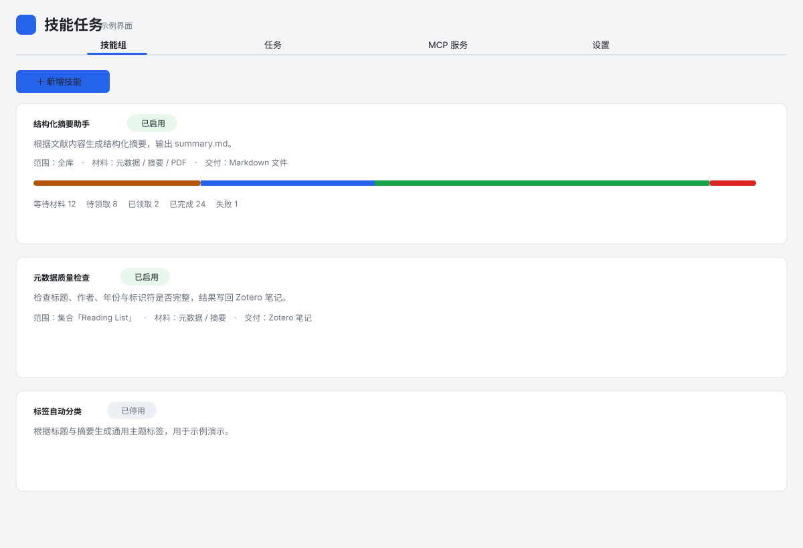
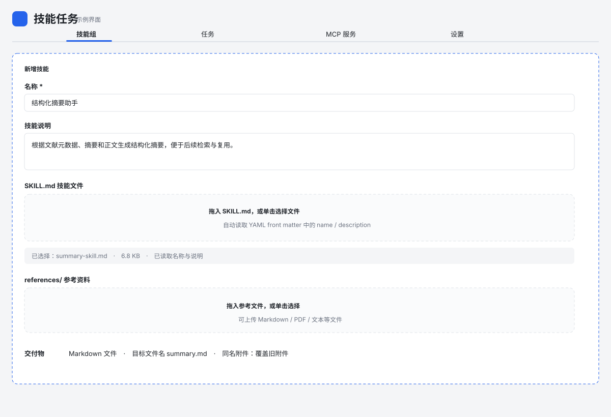
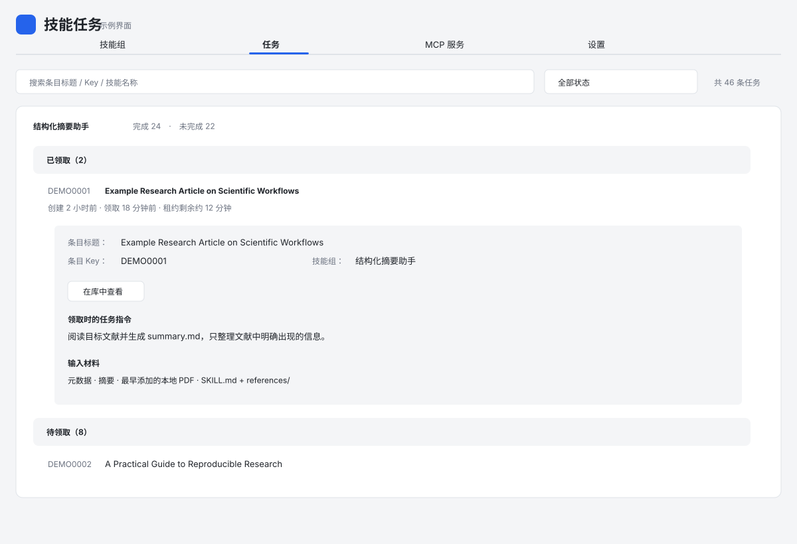
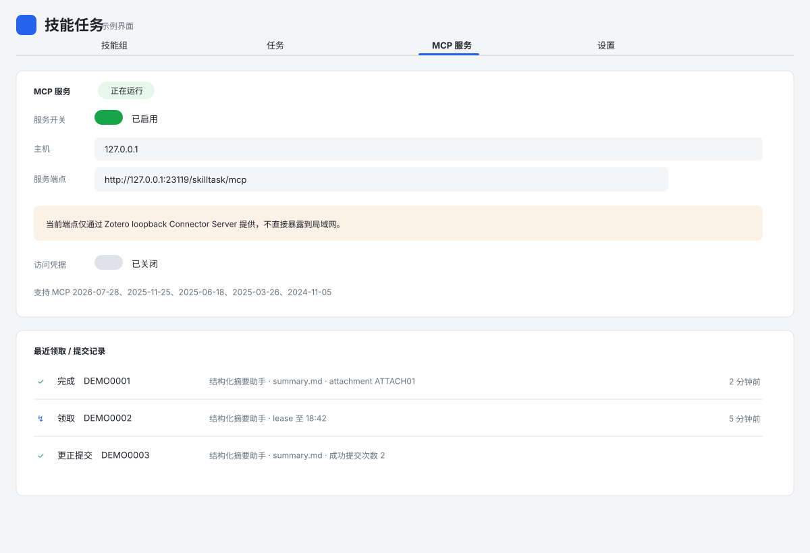

# Zotero Skill Task MCP

一个把 **Zotero 文献变成可被 AI 领取的任务队列** 的桌面插件。

你可以在 Zotero 里定义“技能组”，指定哪些文献需要处理、AI 可以读取哪些材料、最终要交付什么。外部 AI 通过 MCP 领取任务，完成后把结果交回插件，插件再把笔记或文件写回对应 Zotero 条目。

## 能做什么

- 在 Zotero 内创建和管理多个技能组
- 为技能上传 `SKILL.md`
- 可选建立 `references/` 并上传参考文件
- 按全库或指定集合扫描文献并生成任务
- 支持元数据、摘要、笔记、本地 PDF 等输入材料
- 支持 Zotero 笔记、Markdown 文件、普通文件等交付物
- 文件交付可限定固定文件名
- 同名附件可选择“跳过并视为完成”或“覆盖旧附件”
- 任务支持待领取、已领取、等待材料、失败、取消、完成等状态
- 外部 AI 通过 MCP 单条领取和提交任务
- MCP 可直接向插件注入新的技能组和技能文件

插件**不内置 AI，也不会主动启动 AI**。AI 只有在主动调用 MCP 时才会领取任务。


## 界面预览

> 以下界面图按当前前端视觉样式绘制，全部使用虚构示例数据，不包含真实文献、条目 Key、附件 Key 或访问凭据。

<table>
  <tr>
    <td width="50%">
      
      <br><strong>技能组总览</strong>：查看技能状态、任务统计与扫描入口。
    </td>
    <td width="50%">
      
      <br><strong>新增技能</strong>：配置 SKILL.md、references、输入材料和交付物。
    </td>
  </tr>
  <tr>
    <td width="50%">
      
      <br><strong>任务队列</strong>：按状态查看任务、租约、材料、交付物和时间线。
    </td>
    <td width="50%">
      
      <br><strong>MCP 服务</strong>：查看本机端点、访问凭据与最近领取/提交记录。
    </td>
  </tr>
</table>

## 安装

要求：

- Zotero 9 或 10

安装步骤：

1. 打开本仓库的 **Releases**
2. 下载最新的 `.xpi`
3. Zotero → **工具 → 插件**
4. 把 `.xpi` 拖入插件管理器并安装
5. 重启 Zotero
6. Zotero → **工具 → 技能任务…**

## 最简单的使用流程

### 1. 新建技能

打开“技能任务”后进入 **技能组**：

1. 点击新增技能
2. 填写名称和技能说明
3. 上传 `SKILL.md`
4. 如有额外资料，启用 `references/` 并上传参考文件
5. 选择任务范围：
   - 全库
   - 指定 Zotero 集合
6. 选择 AI 可以读取的材料
7. 设置交付物
8. 保存并启用技能

上传 `SKILL.md` 后，插件会自动尝试读取 YAML front matter 中的：

```yaml
---
name: example-skill
description: 这个技能用来……
---
```

并自动回填技能名称和技能说明。

### 2. 生成任务

技能启用后可以重新扫描文献。

插件会根据技能范围和材料要求创建任务。例如技能要求 PDF，而某篇文献还没有本地 PDF，则任务会进入“等待材料”。

### 3. AI 领取任务

外部 AI 主要使用这些 MCP 工具：

- `skilltask_claim`：领取下一条任务
- `skilltask_renew`：任务处理较久时续租一个完整租约周期
- `skilltask_release`：主动归还已领取任务
- `skilltask_status`：只读查看队列计数和当前 claimed 租约
- `skilltask_submit`：提交结果；已完成任务需要更正时显式传 `revise=true`
- `skilltask_inject_skill`：向插件新增技能

每次 `skilltask_claim` 最多返回一条任务。常用字段都在返回的 `task` 对象中：

- `task.id`：后续 renew / release / submit 使用的任务 ID
- `task.itemKey`：目标 Zotero 条目
- `task.leaseExpiresAt`：当前租约过期时间
- `task.deliverable`：本任务要求的交付物格式
- `task.skillAssets`：`SKILL.md` 与 references 文件清单
- `materials`：该技能允许 AI 使用的文献材料

普通重复提交仍然保持幂等，不会产生第二份交付物。只有显式 `revise=true` 才会更正已经完成的结果；插件会优先原位更新原笔记/附件，并记录成功提交次数。

### 4. 查看结果

在 **任务** 模块可以看到各任务状态。

展开任务后可以查看：

- Zotero 条目标题
- 条目 Key
- 技能和版本
- 输入材料
- 交付物
- 创建 / 领取 / 完成时间

点击 **在库中查看** 可以直接跳回 Zotero 并选中对应文献。

## 交付物

目前主要支持：

### Zotero 笔记

AI 返回内容后，插件在对应父条目下创建笔记。

### Markdown / 普通文件

可以保存到插件受控目录，也可以自动挂成 Zotero 附件。

还可以指定固定文件名，例如：

```text
summary.md
review.pdf
result.json
```

如果 Zotero 条目已经有同名附件，可以选择：

- **跳过，并标记任务已完成**
- **覆盖旧附件**

## MCP

在插件的 **MCP 服务** 模块可以：

- 启用 / 关闭 MCP
- 查看 MCP 地址和端口
- 复制服务地址
- 启用 / 关闭访问凭据
- 查看、复制和重新生成访问凭据

默认只监听本机：

```text
127.0.0.1
```

当前同时兼容：

- MCP 2026-07-28
- MCP 2025-11-25
- MCP 2025-06-18
- MCP 2025-03-26
- MCP 2024-11-05

旧版客户端通过 `initialize` 协商协议版本；后续 Streamable HTTP 请求应携带协商后的 `MCP-Protocol-Version`。其中：

- `2025-06-18`、`2025-11-25`：工具声明 `outputSchema`，调用结果同时返回 `content` 与 `structuredContent`
- `2025-03-26`、`2024-11-05`：保留旧式 `content` JSON 文本，不声明 `outputSchema`
- `2026-07-28`：使用无状态 envelope/header，并返回 `structuredContent`、`resultType` 与 server metadata

## 设置

插件主页面中的 **设置** 模块包含：

- 任务领取租约时长
- 默认文件交付大小上限
- 面板快捷键开关
- macOS 快捷键
- Windows / Linux 快捷键

设置修改后立即生效，无需重启 Zotero。

默认快捷键：

- Windows / Linux：`Ctrl+Shift+J`
- macOS：`⌘+Shift+J`

## 数据存在哪里

技能文件：

```text
<Zotero 数据目录>/skilltask/skills/<技能ID>/SKILL.md
<Zotero 数据目录>/skilltask/skills/<技能ID>/references/
```

文件交付物：

```text
<Zotero 数据目录>/skilltask/deliverables/<任务ID>/
```

任务和技能状态同样保存在 Zotero 数据目录下，重启插件后可以恢复。

## 开发

```bash
npm install
npm run typecheck
npm test
npm run build
```

开发模式：

```bash
npm run dev
```

构建后的 XPI 位于：

```text
dist/
```

更详细的需求和技术设计见：

- `需求计划书.md`
- `docs/TECH_VALIDATION_MCP_HTTP.md`
